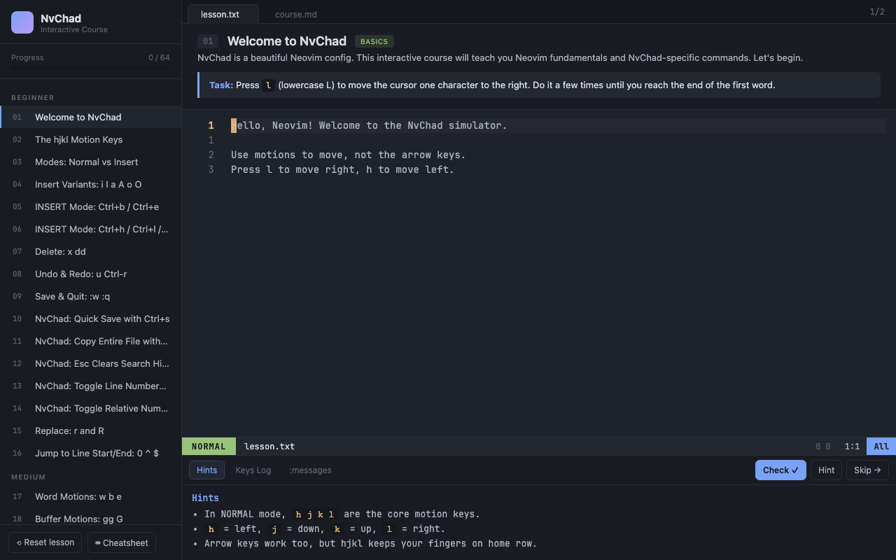

# NvChad Simulator

[](https://react.dev/)
[](https://www.typescriptlang.org/)
[](https://vitejs.dev/)
[](https://pnpm.io/)
[](LICENSE)

An interactive learning simulator for Neovim and NvChad configuration. Master vim motions, modes, operators, and NvChad-specific commands through hands-on, interactive lessons.

**[🚀 Quick Start](#getting-started)** • **[📖 Documentation](#documentation)** • **[💡 Features](#features)** • **[⌨️ Controls](#available-controls)**

## What You'll Learn

Master vim through 64 progressive, interactive lessons:

- **Navigation** - hjkl motions, word/line/buffer navigation, finding characters
- **Editing** - Insert/delete/change/yank operations, undo/redo, visual selection
- **Vim Modes** - Normal, Insert, Visual, and Command modes with smooth transitions
- **NvChad** - Popular mappings, theme cycling, file navigation, terminal commands
- **Advanced** - Text objects, macros, registers, marks, complex workflows
- **Real-world** - Practical vim patterns used by professionals daily

## Table of Contents

1. [Screenshots](#screenshots)
2. [Features](#features)
3. [Tech Stack](#tech-stack)
4. [Getting Started](#getting-started)
5. [Documentation](#documentation)
6. [Usage Guide](#usage)
7. [Keyboard Controls](#available-controls)
8. [Project Structure](#project-structure)
9. [Development](#development)
10. [Resources](#resources)
11. [Contributing](#contributing)

## Screenshots

**View in action:** Run the app and explore interactively:
```bash
pnpm install && pnpm dev
```
Then open `http://localhost:5173` in your browser

### Main Interface - Welcome Lesson



The main learning interface showing:
- **Left Sidebar**: Lesson list organized by BEGINNER, MEDIUM, ADVANCED, GRADUATION sections
- **Center**: Modal editor with lesson content and task instructions  
- **Right Panel**: Real-time hints and validation
- **Bottom**: Status bar showing NORMAL mode and file information
- **Console**: Keyboard logger, hints, and message panels

### Interactive Editor
A full-featured modal vim editor with:
- **Normal Mode** (green indicator) - Navigation and operators
- **Insert Mode** (blue indicator) - Text editing with Ctrl shortcuts
- **Visual Mode** - Character and line selection
- **Command Mode** - Ex-commands (`:w`, `:q`, `:s/old/new/g`)
- **Real-time Rendering** - See cursor and text updates immediately

### Comprehensive Cheatsheet
Accessible via the "Cheatsheet" button showing:
- **MOTIONS** - hjkl, word motions (w, b, e), line navigation (0, ^, $), buffer jumps (gg, G), character finding (f, t)
- **EDITING** - Insert variants (i, I, a, A, o, O), delete (x, dd), change (c, cc), yank (y, yy), operators
- **SEARCH & REPLACE** - Search patterns (/pattern, ?pattern), substitution (:s/old/new/g), case options
- **VISUAL & TEXT OBJECTS** - Visual modes (v, V), text object selections, marks and jumps
- **NVCHAD SPECIFIC** - Telescope (fuzzy finder), NvimTree (file explorer), formatting, diagnostics, window management
- **ADVANCED** - Macros (q, @), registers, global commands, and more

### Progressive Lessons
64 interactive lessons featuring:
- **BEGINNER Section** (Lessons 01-16) - Welcome, hjkl motions, modes, insert variants, deletion, undo/redo, saving
- **MEDIUM Section** (Lessons 17-26) - Word motions, buffer navigation, find char, operators, yank/put, counts, search, visual mode
- **ADVANCED Section** (Lessons 27-48) - Window management, file operations, text objects, macros, registers, marks, formatting
- **GRADUATION Section** (Lessons 49-64) - Real-world workflows and professional vim patterns

Each lesson includes:
- Clear task description
- Progressive hints
- Real-time validation
- Achievement tracking

## Features

- **Interactive Modal Editor Simulation** - Full-featured vim modal editor built with React
- **64 Progressive Lessons** - Organized into BEGINNER, MEDIUM, ADVANCED, and GRADUATION sections
- **Real-time Feedback** - Instant validation and hints for each lesson task
- **Comprehensive Cheatsheet** - Quick reference for vim motions, editing, search, and NvChad commands
- **Progress Tracking** - Persistent progress saved to localStorage
- **Multiple Themes** - 5 built-in color schemes with theme cycling
- **Keyboard Logging** - Visual keypress logging for learning and debugging
- **NvChad-Specific Content** - Learn popular NvChad mappings and workflows

## Tech Stack

- **React 18.3.1** - UI framework
- **TypeScript 5.9** - Type-safe development
- **Vite 5.4** - Fast build tool and dev server
- **pnpm** - Efficient package manager

## Getting Started

**New here?** Check out the [Quick Start Guide](docs/QUICK_START.md) to get up and running in 5 minutes!

## Installation

### Prerequisites
- Node.js 16+ 
- pnpm (install globally: `npm install -g pnpm`)

### Setup

```bash
# Clone or navigate to the project directory
cd nvim-simulator

# Install dependencies with pnpm
pnpm install

# Start the development server
pnpm dev
```

The application will be available at `http://localhost:5173`

## Documentation

Comprehensive guides for different needs:

- **[Quick Start Guide](docs/QUICK_START.md)** - Get running in 5 minutes, learn your first lesson
- **[Architecture Guide](docs/ARCHITECTURE.md)** - Deep dive into how the simulator works
- **[Screenshots Guide](docs/SCREENSHOTS.md)** - Visual tour of the interface

## Usage

### Learning Lessons

1. **Browse Lessons** - Select lessons from the left sidebar organized by difficulty
2. **Read Task Description** - Understand what vim commands you need to practice
3. **Practice in Editor** - Use the modal editor to complete the task
4. **Check Progress** - Click "Check ✓" to validate your solution
5. **View Hints** - Click "Hint" to get guidance when stuck
6. **Skip if Needed** - Click "Skip →" to move to the next lesson

### Available Controls

#### Navigation
- **hjkl** - Move cursor (left, down, up, right)
- **w/b/e** - Move by word
- **0/^/$** - Jump to line start/middle/end
- **gg/G** - Jump to first/last line
- **f{c}/t{c}** - Find character on line

#### Modes
- **i/I/a/A/o/O** - Enter INSERT mode variants
- **v/V** - Enter VISUAL/VISUAL-LINE mode
- **:** - Enter COMMAND mode
- **Esc** - Return to NORMAL mode

#### Editing
- **x/X** - Delete character
- **dd/D** - Delete line/to end of line
- **c/C** - Change operator
- **y/yy** - Yank (copy)
- **p/P** - Paste after/before
- **u/Ctrl-r** - Undo/Redo
- **.** - Repeat last change

#### NvChad Mappings
- **Ctrl+s** - Quick save
- **Ctrl+c** - Copy entire file
- **Ctrl+n** - Toggle NvimTree (file explorer)
- **Ctrl+hjkl** - Window navigation
- **<leader>ff** - Telescope find files
- **<leader>n** - Toggle line numbers
- And many more...

### Keyboard Shortcuts

- **?** - Toggle cheatsheet modal
- **Tab** - Switch between hints, key log, and messages panels
- **Ctrl+hjkl** - Window navigation in NORMAL mode

## Project Structure

```
nvim-simulator/
├── src/
│   ├── components/          # React components
│   │   ├── App.tsx         # Root component
│   │   ├── Editor.tsx      # Main editor area
│   │   ├── Statusline.tsx  # Mode indicator
│   │   ├── Cursor.tsx      # Cursor rendering
│   │   ├── Buffer.tsx      # Text buffer display
│   │   ├── Cmdline.tsx     # Command line input
│   │   ├── Cheatsheet.tsx  # Cheatsheet modal
│   │   ├── LessonList.tsx  # Lesson sidebar
│   │   ├── Console.tsx     # Output console
│   │   ├── Toast.tsx       # Notification system
│   │   └── ...
│   ├── hooks/
│   │   └── useSimulator.ts # Core vim editor logic (1150+ lines)
│   ├── data/
│   │   └── lessons.ts      # 60+ lessons, cheatsheet, themes
│   ├── types.ts            # TypeScript type definitions
│   ├── App.css             # Global styles
│   └── main.tsx            # Entry point
├── index.html              # HTML template
├── tsconfig.json           # TypeScript config (strict mode)
├── vite.config.ts          # Vite config
└── package.json            # Dependencies and scripts
```

## Core Features Implementation

### Modal Editor Engine (`useSimulator.ts`)

The heart of the simulator is a custom React hook that implements a full modal editor:

- **Mode Management** - NORMAL, INSERT, VISUAL, VISUAL-LINE, COMMAND modes
- **Motion System** - Character, word, line, and buffer motions
- **Operator Composition** - Operators (d, c, y) composed with motions
- **Visual Selection** - Character and line-based visual modes
- **Command Mode** - `:w`, `:q`, `:s/old/new/g` and other ex-commands
- **History & Undo** - Full undo/redo with history stack
- **Search** - `/pattern`, `?pattern`, `n`, `N` navigation

### Lesson System

Each lesson includes:
- **Task Description** - What vim skill to practice
- **Initial Buffer** - Starting text content
- **Validation Function** - Checks if task completed correctly
- **Hints** - Progressive hints for guidance
- **Difficulty Badge** - BASICS, MOTION, OPERATOR, etc.

### Theming

5 built-in color schemes with CSS variables:
- Default (dark blue/purple)
- Dracula (popular dark theme)
- Nord (arctic colors)
- Gruvbox (warm colors)
- Tokyo Night (neon theme)

## Development

### Build for Production

```bash
pnpm build
```

Output goes to `dist/` directory.

### Preview Production Build

```bash
pnpm preview
```

### Type Checking

The project uses TypeScript strict mode for full type safety across:
- React components and props
- Custom hooks and state
- Lesson definitions and checks
- UI callbacks and event handlers

## Lesson Categories

### BEGINNER (Lessons 01-16)
- Welcome & Basic Navigation
- hjkl Motion Keys
- Mode Switching
- Insert Mode Variants
- Deletion (x, dd)
- Undo & Redo
- Saving & Quitting
- NvChad Features (theme cycling, number toggle, etc.)

### MEDIUM (Lessons 17-26)
- Word Motions (w, b, e)
- Buffer Navigation (gg, G)
- Find Character (f, t)
- Change Operators (cw, C)
- Yank & Put (yy, p, P)
- Counts ({N}motion)
- Search (/, ?, n, N)
- Visual Mode (v, V)

### ADVANCED (Lessons 27-48)
- Window Management
- File Operations (NvimTree, Telescope)
- Text Objects & Marks
- Macros & Registers
- Formatting & Diagnostics
- Advanced Search & Replace

### GRADUATION (Lessons 49-64)
- Real-world Vim Workflows
- Complex Editing Patterns
- Performance Optimization
- Professional NvChad Usage

## Performance

- **Fast Hot Reload** - Vite provides instant feedback during development
- **Optimized Bundle** - 210.50 KB total output (64.62 KB gzipped)
- **Efficient Rendering** - React components only update on state changes
- **LocalStorage Caching** - Completed lessons persisted locally

## Browser Support

- Chrome/Edge 90+
- Firefox 88+
- Safari 14+

## Contributing

To extend the simulator:

1. **Add New Lessons** - Edit `src/data/lessons.ts` and add to LESSONS array
2. **Extend Editor Logic** - Modify `src/hooks/useSimulator.ts` for new commands
3. **Create Components** - Add new React components in `src/components/`
4. **Update Types** - Extend interfaces in `src/types.ts`

## License

MIT License - Feel free to use for learning and educational purposes.

## Resources

- [Neovim Official Docs](https://neovim.io/doc/)
- [NvChad Repository](https://github.com/NvChad/NvChad)
- [Vim Cheatsheet](https://vim.rtorr.com/)
- [Interactive Vim Tutorial](https://www.openvim.com/)

## Credits

Built as an interactive learning tool to help developers master Neovim and NvChad configuration. Combines vim educational content with a React-based simulator for hands-on practice.

---

**Happy Learning! 🚀**

Master vim one lesson at a time. Start with the basics and progress through increasingly advanced vim techniques and NvChad-specific workflows.
